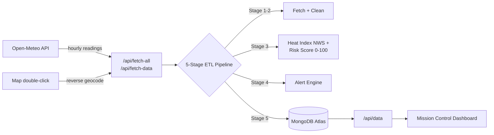

# 🛰️ Earth Observation Platform

A full-stack environmental monitoring system that ingests live atmospheric data through a five-stage ETL pipeline, computes NWS-standard heat-index and risk scores, and surfaces real-time alerts on a telemetry-style command dashboard.

**🔴 Live demo:** https://mapatingin.vercel.app


---

## ✨ Features

- **Real-time ingestion** — live temperature, humidity, and cloud-cover data from the [Open-Meteo API](https://open-meteo.com/) for multiple Philippine cities
- **5-stage ETL pipeline** — API Fetch → Data Cleaning → Feature Engineering → Risk Evaluation → Storage, visualized live as data flows through
- **NWS-standard heat index** — computed with the National Weather Service [Rothfusz regression](https://www.wpc.ncep.noaa.gov/html/heatindex_equation.shtml), not an approximation
- **Normalized risk scoring** — a true 0–100 composite that maps heat index onto NWS heat-stress bands, weighted with humidity and cloud cover
- **Tiered alert engine** — MEDIUM/HIGH heat alerts graded against real heat-stress thresholds, plus storm-indicator and humidity alerts
- **Ad-hoc analysis** — double-click anywhere on the interactive map to run an on-demand environmental scan, reverse-geocoded via OpenStreetMap Nominatim
- **Real trend tracking** — metric deltas and 24-hour trend charts computed from stored history, not placeholders
- **Full observability** — raw payloads, processed results, and per-stage pipeline logs persisted to MongoDB Atlas

## 🏗️ Architecture



**Collections:** `RawData` (original API payloads) · `ProcessedData` (computed metrics, compound-indexed on `location + timestamp`) · `PipelineLog` (per-run stage, status, duration)

## 🧮 Methodology

- **Heat Index:** NWS Rothfusz regression — the simple Steadman formula at lower temperatures, the full nine-term regression (with low-humidity and high-humidity adjustments) when conditions warrant, per the official NWS algorithm.
- **Risk Score:** heat index normalized onto the NWS heat-stress range (27°C = no stress → 54°C = extreme danger), then combined as `0.6·heat + 0.25·humidity + 0.15·cloud`, clamped to 0–100.
- **Alert thresholds:** heat alerts at ≥ 32°C (MEDIUM, "extreme caution" band) and ≥ 41°C (HIGH, "danger" band) heat index.

## 🛠️ Tech Stack

| Layer | Technology |
|-------|-----------|
| Frontend | Next.js 16 (App Router), React 19, Tailwind CSS v4 |
| Charts | Recharts |
| Map | Leaflet (raw API, SSR-safe dynamic import) |
| Backend | Next.js API Routes (serverless) |
| Database | MongoDB Atlas (Mongoose) |
| Testing | Vitest |
| CI | GitHub Actions (lint + test + build) |
| Deployment | Vercel |

## 🎨 Design

Telemetry-grade command-center design system:

- **Fonts:** Space Grotesk (display) · IBM Plex Sans (body) · IBM Plex Mono (data)
- **Surfaces:** three-layer dark system (`#0b0f1a` base / `#121826` panel / `#1a2333` elevated)
- **Color as meaning:** cyan reserved for live data, safety orange for primary actions, semantic green/amber/rose for risk states
- WCAG-conscious contrast, `prefers-reduced-motion` respected

## 🚀 Getting Started

### Prerequisites
- Node.js **20.19+**
- MongoDB Atlas account ([free tier](https://www.mongodb.com/cloud/atlas))

### Setup

```bash
git clone https://github.com/YOUR_USERNAME/YOUR_REPO.git
cd YOUR_REPO
npm install
```

Create `.env.local` in the root:

```env
MONGODB_URI=mongodb+srv://<username>:<password>@cluster0.xxxxx.mongodb.net/earth-obs?retryWrites=true&w=majority
```

> **Atlas setup:** create a free cluster → add a database user with read/write → Network Access: allow `0.0.0.0/0` (required for Vercel's rotating serverless IPs) → copy the connection string. URL-encode any special characters in the password.

```bash
npm run dev
```

Open [http://localhost:3000](http://localhost:3000) — an initial pipeline run triggers automatically if the database is empty.

### Tests

```bash
npm test
```

Unit tests cover the heat-index regression (validated against NWS reference values), risk-score normalization and clamping, and alert threshold boundaries.

## 📦 Deployment (Vercel)

1. Push to GitHub and import the repo in [Vercel](https://vercel.com)
2. Add `MONGODB_URI` as a Production environment variable
3. Deploy (redeploy after any env variable change — they don't apply retroactively)

## 📁 Project Structure

```
├── app/
│   ├── page.tsx                    # Mission Control dashboard
│   ├── layout.tsx                  # Root layout + font setup
│   ├── globals.css                 # Design tokens (Tailwind v4 @theme) + Leaflet overrides
│   └── api/
│       ├── fetch-data/route.ts     # Single-location pipeline trigger
│       ├── fetch-all/route.ts      # All-locations pipeline trigger
│       └── data/route.ts           # Data retrieval endpoint
├── components/
│   ├── MetricCard.tsx              # KPI cards with real trend deltas
│   ├── LocationOverview.tsx        # Location summary table
│   ├── AlertPanel.tsx              # Live alert feed
│   ├── PipelineVisualizer.tsx      # ETL stage visualization
│   ├── TemperatureChart.tsx        # 24h trend chart with empty state
│   ├── LocationMap.tsx             # Map wrapper (SSR-safe)
│   ├── MapInner.tsx                # Raw Leaflet implementation
│   ├── GlobalAlertBanner.tsx       # Critical alert banner
│   └── AdHocAnalysisPanel.tsx      # Double-click scan results
├── lib/
│   ├── calculations.ts             # Pure math: NWS heat index, risk score
│   ├── alertEngine.ts              # Threshold-based alert evaluation
│   ├── pipeline.ts                 # Full ETL orchestration
│   ├── mongodb.ts                  # Mongoose connection singleton
│   ├── locations.ts                # Monitored location config
│   └── __tests__/                  # Vitest unit tests
├── models/                         # Mongoose schemas (RawData, ProcessedData, PipelineLog)
├── .github/workflows/ci.yml        # Lint + test + build on every push
├── .env.example
└── README.md
```

## ⚠️ Limitations & Production Considerations

This is a portfolio/demonstration project. For production use it would need:

- **API protection** — the pipeline-trigger endpoints are currently unauthenticated; a shared secret, auth layer, or rate limiting would prevent unbounded writes
- **Scheduled ingestion** — data collection runs from connected clients (30s polling); a cron job or queue would decouple ingestion from traffic
- **Data retention** — a TTL index on `RawData` to cap storage growth on the free tier
- **Historical backfill** — trends currently build forward from first deployment rather than from historical archives

## 📄 License

MIT
